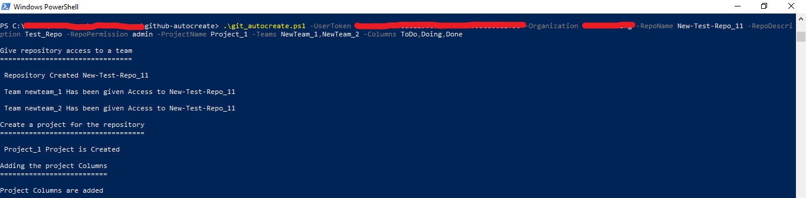

# Auto-Create GitHub Resources

## Overview

A series of powershell scripts to help interact with github's repositories and organizations. With few inputs, the scripts will help to create a repository, provide access to those repositories to teams and create projects for those repositories

## Auto-Create Script

### Pre-requisites

- Powershell Version 4.0 and above
- Member access to the GitHub organization
- GitHub PAT
- Existing teams in the organization will only be considered

### How it works

The script sends four requests to separate GitHub's api endpoints to create the respective Repository , provide access to the said repository to teams and create a project and project columns.

#### Required Inputs

- GitHub Team Names for providing repository access
- Repository Name and description to be given
- Project name to be added to the repository
- Repository Permissions to be given
- Organization Name and GitHub PAT

#### Run With Powershell

Download the script to a directory and navigate to the directory in powershell

```
.\git_autocreate.ps1 -UserToken ********* -Organization ******* -RepoName New-Test-Repo_5 -RepoDescription Test Repo -RepoPermission admin -ProjectName Project_1 -Teams NewTeam_1,NewTeam_2 -Columns ToDo,Doing,Done
```


#### Project Columns

By default ToDo, InProgress and Done columns will be added to the project if no parameters are given when executing the script. The Column names can be changed by adding new column names in Columns Parameter

### Note

- Only one repository permission parameter is accepted. Another script can be used to vary the permissions
- The Project Columns Will be added with no automation enabled.


