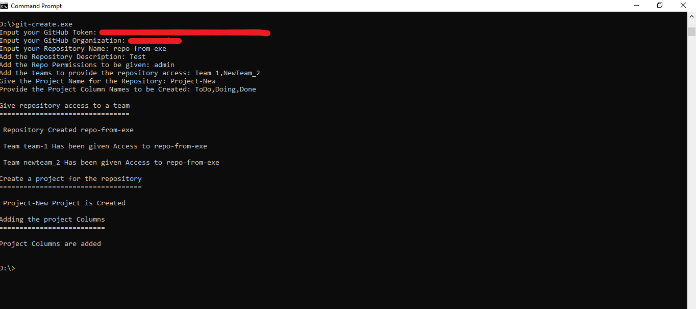
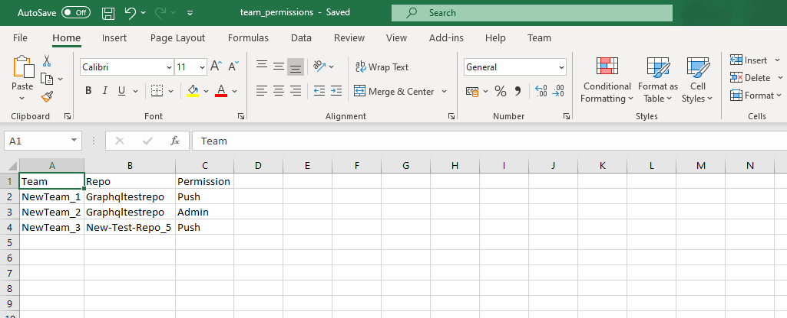

# Auto-Create GitHub Resources

## Overview

A series of powershell scripts to help interact with github's repositories and organizations. With few inputs, the scripts will help to create a repository, provide access to those repositories to teams and create projects for those repositories

## Auto-Create Script

### Pre-requisites

- GitHub PAT
- Existing teams in the organization will only be considered
- Admin access to the organization for creating the repositories

### How it works

The script sends four requests to separate GitHub's api endpoints to create the respective Repository , provide access to the said repository to teams and create a project and project columns.

#### Required Inputs

- GitHub Team Names for providing repository access
- Repository Name and description to be given
- Repository Permissions to be given
- Organization Name and GitHub PAT
- Project name to be added to the repository and the project column names

#### Run With cmd

Download the exe and run it in cmd. Provide the required inputs. The Team Names and the Project Column Names are array inputs and must given in the following format

Eg. Team 1,Team_2,Team-3 
Eg. ToDo,Doing,Done

#### Project Columns

By default ToDo, InProgress and Done columns will be added to the project if no parameters are given when executing the script. The Column names can be changed by adding new column names in Columns Parameter

### Note

- Only one repository permission parameter is accepted. Another script can be used to vary the permissions
- The Project Columns Will be added with no automation enabled.

## Teams-Repository Access

### Overview

Using this script bulk repository access can be given to the respective teams. With an Excel file as Input, the permissions are granted to the teams.

#### Sample Excel File

### Pre-requisites

- Excel File with Team Names, repositories and permissions. 
- PAT Token must be authorized to access the required organization

#### Required Inputs

- Excel file source
- Authorized GitHub PAT
- Organization Name
- Worksheet name where the data is present

#### Run With cmd

Download the exe and run it, specify the required inputs 

